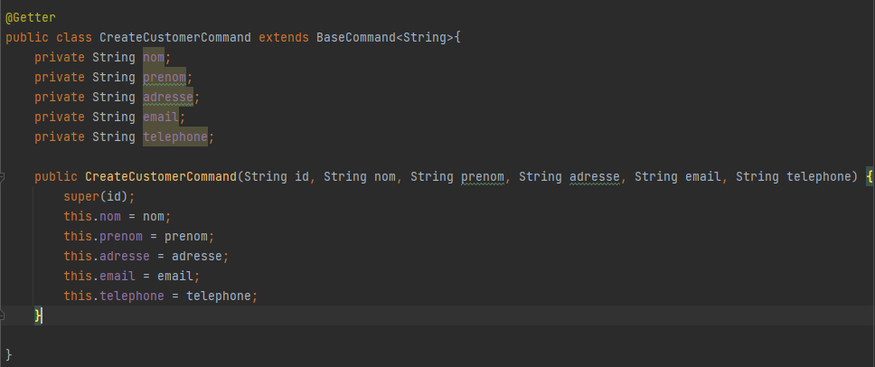
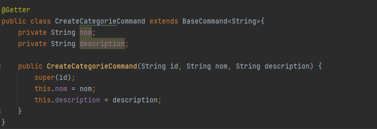
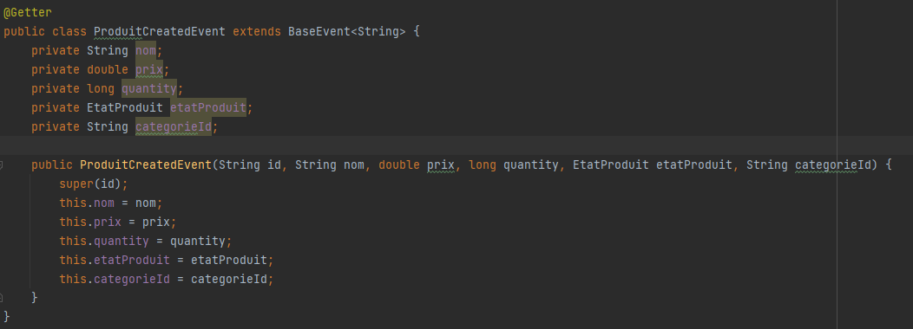
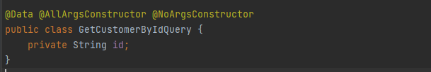
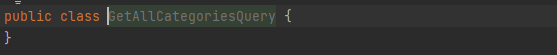
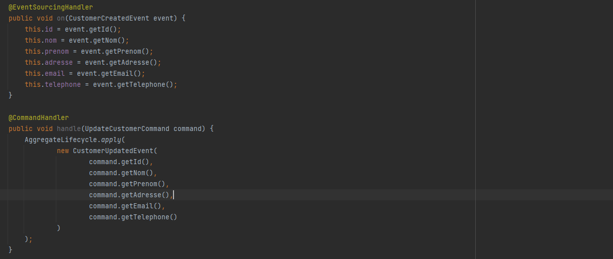
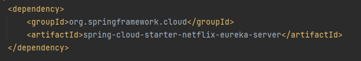
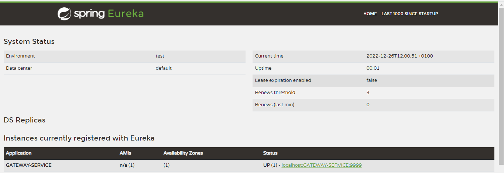
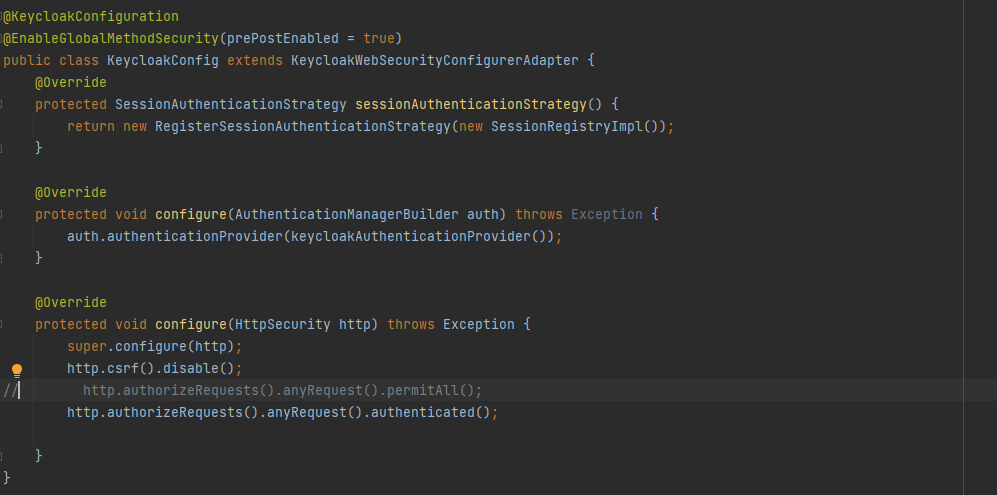
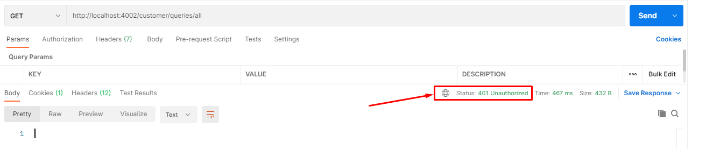

<h2 align="center"><💻 Examen ELYOUSFI Mohamed 💻/></h2>
<h5>- Architecture</h5>

<h5>Diagramme de classe</h5>

<h5>Axon Server</h5>

    
📝 Common-Api (Clique to expand 🖱️) <a href="" target="_blank">[Code Source]</a>

    

        
Common-Api

        
        
<b>Commands</b>

        
BaseCommand

        
        
CreateCustomerCommand

        
        
UpdateCustomerCommand

        
        
CreateProduitCommand

        
        
Enum EtatProduit

        
        
UpdateProduitCommand

        
        
CreateCategoryCommand

        
        
UpdateCategoryCommand

        
        
CreateLigneCommandeCommand

        
        
UpdateLigneCommandeCommand

        
        
CreateCommandeCommand

        
        
Enum etatCommande

        
        
UpdateCommandeCommand

        
        
<b>Events</b>
 
        
BaseEvent

        
        
CustomerCreatedEvent

        
        
CustomerUpdatedEvent

        
        
ProduitCreatedEvent

        
        
ProduitUpdatedEvent

        
        
CategoryCreatedEvent

        
        
CategoryUpdatedEvent

        
        
LigneCommandeCreatedEvent

        
        
LigneCommandeUpdatedEvent

        
        
CommandeCreatedEvent

        
        
CommandeUpdatedEvent

        
        
<b>Dtos</b>

        
CreateCustomerRequestDto

        
        
UpdateCustomerRequestDto

        
        
CreateProduitRequestDto

        
        
UpdateProduitRequestDto

        
        
CreateCategoryRequestDto

        
        
UpdateCategoryRequestDto

        
        
CreateLigneCommandeRequestDto

        
        
UpdateLigneCommandeRequestDto

        
        
CreateCommandeRequestDto

        
        
UpdateCommandeRequestDto

        
        
<b>Queries</b>

        
GetAllCustomersQuery

        
        
GetCustomerByIdQuery

        
        
GetAllProduitsQuery

        
        
GetProduitByIdQuery

        
        
GetAllCategoriesQuery

        
        
GetCategoryByIdQuery

        
        
GetAllLigneCommandesQuery

        
        
GetLigneCommandeByIdQuery

        
        
GetAllCommandesQuery

        
        
GetCommandeByIdQuery

        
        <!--<pre>
            <code>
            </code>
        </pre>-->
    

    
📝 Customer-Service (Clique to expand 🖱️) <a href="" target="_blank">[Code Source]</a>

    <h5>- Command-side</h5>
    
CustomerAggregate

    
    
    
    
CustomerController

    
    
    <h5>- Query-side</h5>
    
CustomerEntity

    
    
CustomerRepository

    
    
CustomerService

    
        
    
CustomerController

    
    
    
Test

    
Add a customer

    
    
modify a customer

    
    
get all customers

    
    
get a customer by id

    
    
database

    
    
eventStore

    

    
📝 Inventory-Service (Clique to expand 🖱️) <a href="" target="_blank">[Code Source]</a>

    <h5>- Command-side</h5>
    
ProductAggregate

    
    
    
    
CategorieAggregate

    
    
    
 

    
    
    
CategorieController

    
    
    <h5>- Query-side</h5>
    
ProductEntity

    
    
ProductRepository

    
    
ProductService

    
    
    
ProductController

    
    
    
CategorieEntity

    
    
CategorieRepository

    
    
CategorieService

    
    
    
CategorieController

    
    
    
Test

    
Add a categorie

    
    
Get all categories

    
    
Add a product

    
    
Get all products

    
    
Base de données

    
    
    
EventStore

    
     

    
📝 Order-Service (Clique to expand 🖱️) <a href="" target="_blank">[Code Source]</a>

    <h5>Pas fait</h5>

    
📝 Gateway, Discovery service (Clique to expand 🖱️) <a href="" target="_blank">[Code Source]</a>

    <h5>Discovery service</h5>
    
dependency eureka server

    
    
DiscoveryServiceApplication

    
    <h5>Gateway service</h5>
    
dependency eureka client

    
    
Gateway configuration

    
    
    
http://localhost:8761

    
    <h3>

    
📝 Securité des microservices - Keycloak (Clique to expand 🖱️) <a href="" target="_blank">[Code Source]</a>

    <h5>Sécurité des microservices</h5>
    
examen-realm

    
    
examen-client

    
    
user mohamed

    
    
creation des roles (Admin, User)

    
    
affecter les roles aux user "mohamed"

    
    
dependences

    
    
application.properties

    
    
Configuration

    
    
    <h5>Test (Postman)</h5>
    
Unauthorized

    
    
get access token

    
    
access to /infraction/queries/getAllInfracations using the token

    
    <important style="font-weight: bold; color: red;">meme démarche pour les autres microservices<important>
    
    

    
📝 Frontend Angular (Clique to expand 🖱️) <a href="" target="_blank">[Code Source]</a>

    <h5>Frontend Angular</h5>

